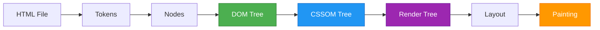
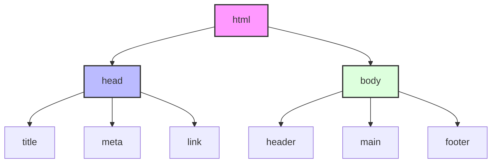
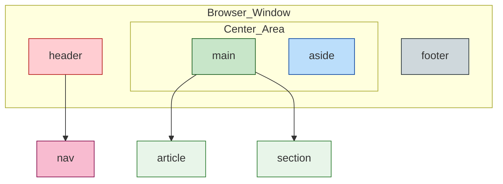
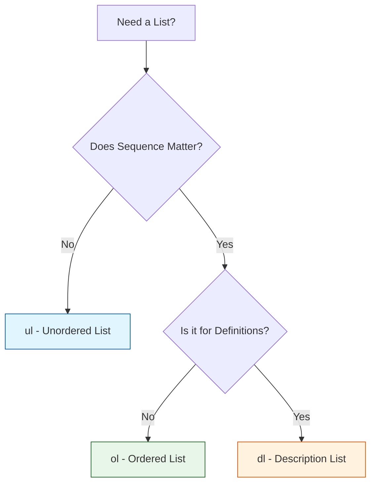
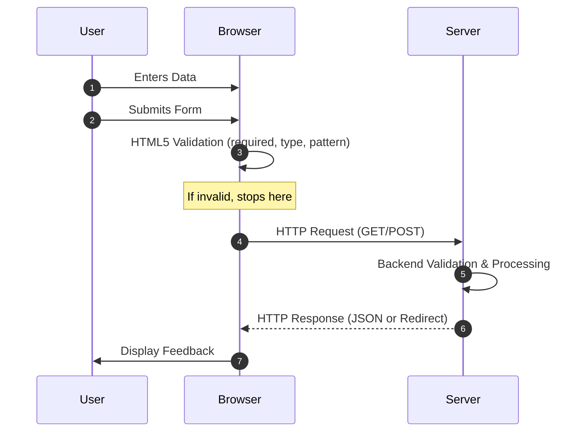
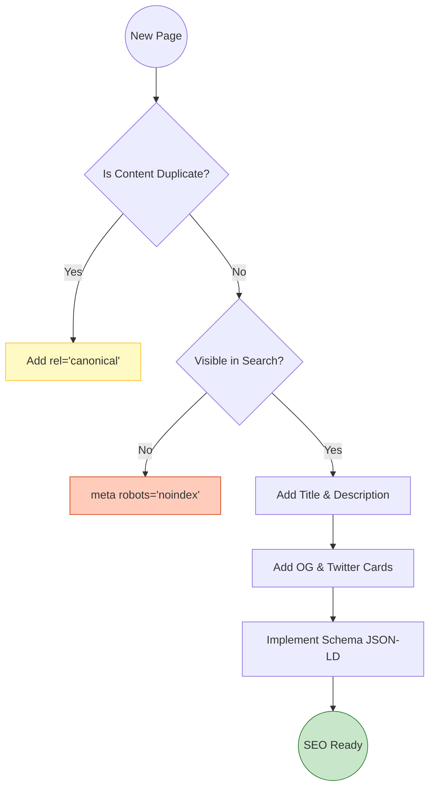
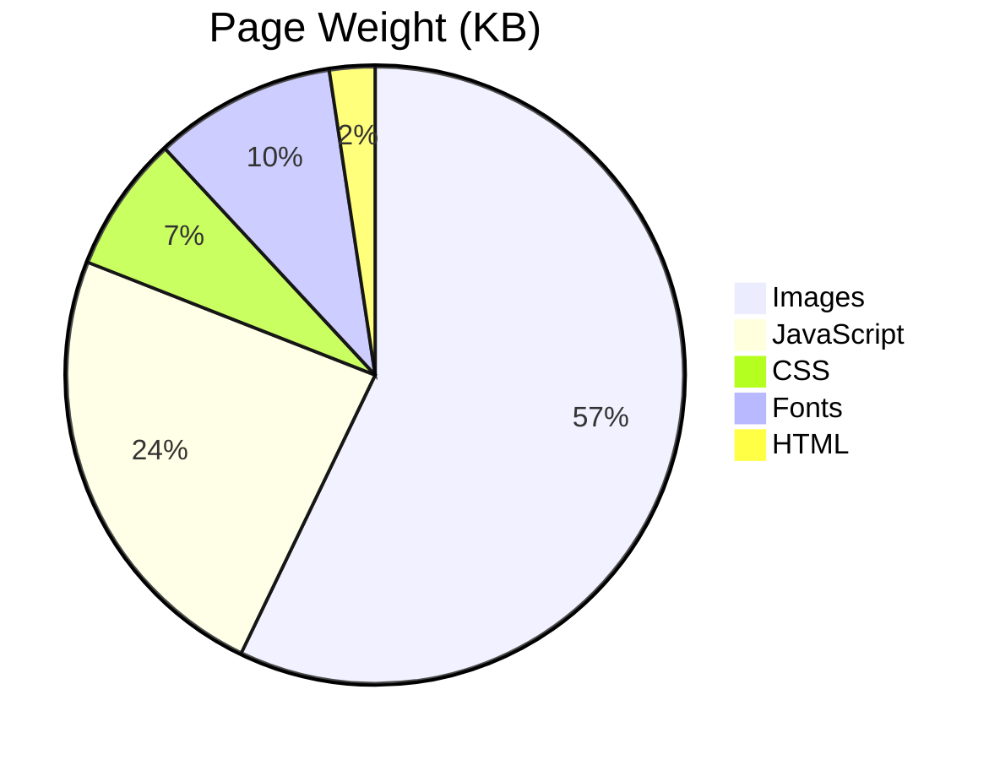
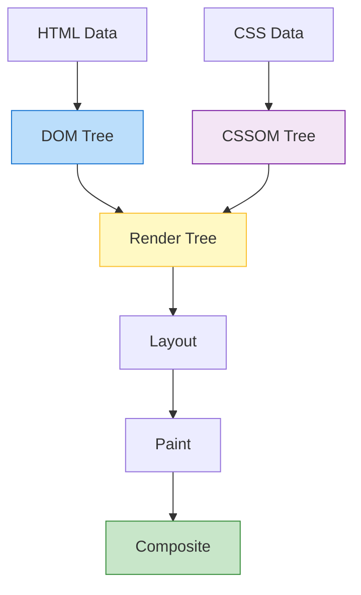
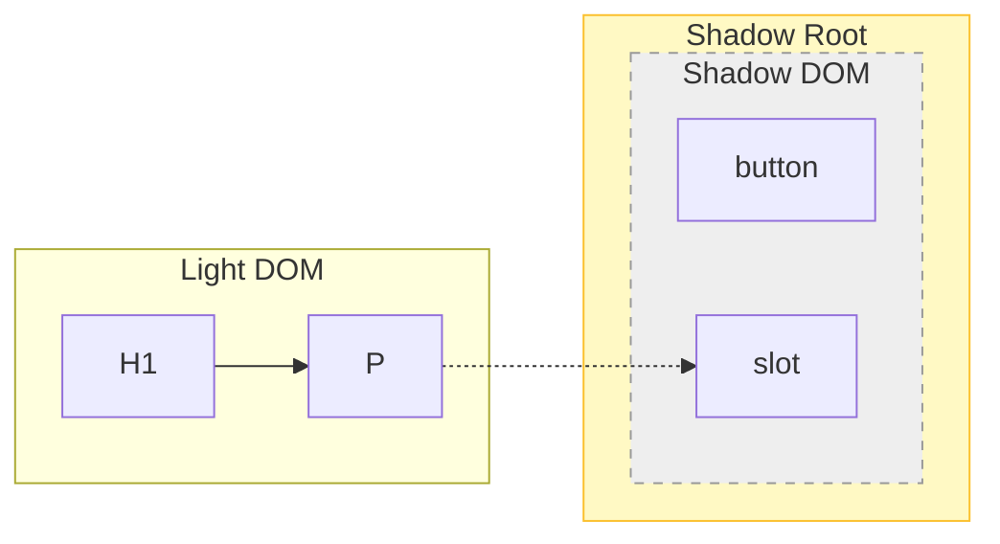

# HTML Fundamentals Comprehensive Guide

## Table of Contents
1. [HTML Fundamentals](#1-html-fundamentals)
2. [Core Document Structure](#2-core-document-structure)
3. [Text Content & Semantics](#3-text-content--semantics)
4. [Semantic HTML (Critical)](#4-semantic-html-critical)
5. [Links & Navigation](#5-links--navigation)
6. [Lists](#6-lists)
7. [Images & Media](#7-images--media)
8. [Audio & Video](#8-audio--video)
9. [Tables](#9-tables)
10. [Forms (Absolutely Mandatory)](#10-forms-absolutely-mandatory)
11. [HTML Accessibility (A11y)](#11-html-accessibility-a11y)
12. [HTML Global Attributes](#12-html-global-attributes)
13. [Metadata & SEO Basics](#13-metadata--seo-basics)
14. [HTML & CSS Integration](#14-html--css-integration)
15. [HTML & JavaScript Integration](#15-html--javascript-integration)
16. [Performance & Optimization](#16-performance--optimization)
17. [Security Basics in HTML](#17-security-basics-in-html)
19. [Advanced Semantic & Modern Elements](#19-advanced-semantic--modern-elements)
20. [Web Components (HTML Perspective)](#20-web-components-html-perspective)
21. [Progressive Web App (PWA) HTML Aspects](#21-progressive-web-app-pwa-html-aspects)
22. [Internationalization (i18n)](#22-internationalization-i18n)
23. [Microdata & Structured Data](#23-microdata--structured-data)
24. [HTML Emails (Bonus Skill)](#24-html-emails-bonus-skill)
25. [HTML for Frameworks](#25-html-for-frameworks)
26. [HTML Testing & Debugging](#26-html-testing--debugging)
27. [Deprecated & Legacy Knowledge](#27-deprecated--legacy-knowledge)

---

# 1. HTML Fundamentals

HTML (HyperText Markup Language) is the standard language used to create the structure of web pages. It is not a programming language in the sense that it does not handle logic or calculations; instead, it is a markup language that tells the browser how to organize and display content. Understanding HTML is the first and most essential step in web development.

---

### What HTML Is and How the Browser Parses HTML

HTML acts as the skeleton of a website. It uses a system of "markup" to annotate text, images, and other media so the browser understands their purpose—whether something is a heading, a paragraph, or a link.

**Parsing** is the process where a web browser reads your HTML code and converts it into a visual webpage. The browser reads the file from top to bottom, creating a "map" of the document known as the **DOM (Document Object Model)**. If the HTML is the blueprint, the DOM is the actual framework the browser uses to render the pixels on your screen.

#### HTML Parsing Workflow


### HTML Versions and Living Standard Concept

In the early days of the web, HTML was released in version increments (such as HTML 4.01 or XHTML). However, this meant that the language only improved every few years.

Today, HTML is managed as a **Living Standard** by the WHATWG (Web Hypertext Application Technology Working Group). This means that HTML is no longer a "versioned" language. Instead, it is a continuously evolving specification. Features are added or refined as technology changes, ensuring that the web stays modern without needing a "HTML 6."

### Anatomy of an HTML Document

A standard HTML file follows a strict, nested hierarchy. Each part of the "anatomy" serves a specific purpose:

1.  **The Root Element (`<html>`):** The container for everything else in the document.
2.  **The Head (`<head>`):** Contains metadata (data about the data) that isn't visible to the user, such as the page title, character encoding, and links to CSS files.
3.  **The Body (`<body>`):** Contains all the content that users actually see, such as text, images, and buttons.

### Doctype and Standards Mode

The very first line of an HTML document must be the **Doctype declaration**:

```html
<!DOCTYPE html>
```

The Doctype is not an HTML tag; it is a preamble that tells the browser which version of HTML the page is using. By using `<!DOCTYPE html>`, you trigger **Standards Mode**. This ensures the browser follows modern web specifications. If the Doctype is missing, browsers may enter "Quirks Mode," where they try to emulate older, buggy rendering engines from the 1990s, which often breaks modern layouts.

### HTML Syntax Rules

To ensure browsers parse code correctly, developers must follow specific syntax rules:

*   **Tags:** Keywords surrounded by angle brackets, such as `<p>`.
*   **Opening and Closing:** Most elements require an opening tag (`<p>`) and a closing tag (`</p>`) that includes a forward slash.
*   **Nesting:** Elements must be closed in the reverse order they were opened. For example:
    *   Correct: `<p><strong>Bold text</strong></p>`
    *   Incorrect: `<p><strong>Bold text</p></strong>`
*   **Case Sensitivity:** While HTML tags are case-insensitive (`<DIV>` is the same as `<div>`), the industry standard is to always use lowercase.

### Elements vs Attributes

While these terms are often used interchangeably, they represent different parts of the code:

*   **Element:** The entire unit, from the opening tag to the closing tag, including the content inside.
*   **Attribute:** Special words placed inside the opening tag to provide additional information or behavior. Attributes usually come in name/value pairs.

```html
<!-- The whole line is an element -->
<a href="https://google.com">Click Here</a>

<!-- 'href' is the attribute name, the URL is the attribute value -->
```

### Void Elements

Most elements contain content (like text or other tags), but **Void Elements** do not. Because they have no content, they do not require a closing tag. 

| Tag | Purpose | Example |
| :--- | :--- | :--- |
| `` | Embeds an image | `` |
| `<br>` | Line break | `Line 1<br>Line 2` |
| `<hr>` | Horizontal separator | `<hr>` |
| `<input>` | User input field | `<input type="text">` |
| `<link>` | Links external resources | `<link rel="stylesheet">` |
| `<meta>` | Document metadata | `<meta charset="UTF-8">` |

In modern HTML, you can write them as `` or ``. Both are technically correct, though the first is more common in HTML5.

### Block vs Inline Elements

The browser categorizes elements based on how they sit on the page:

1.  **Block-level Elements:** These always start on a new line and take up the full width available. They act as "containers" or "blocks." Examples include `<div>`, `<h1>` through `<h6>`, and `<p>`.
2.  **Inline Elements:** These do not start on a new line. They only take up as much width as their content requires and sit side-by-side with other inline elements. Examples include `<span>`, `<a>`, and `<strong>`.

### HTML Comments

Comments are notes left for the developer that the browser ignores entirely. They are useful for documenting why a certain piece of code exists or for organizing long files.

**Syntax:**
```html
<!-- This is a comment. It will not show up on the website. -->

<p>This text will be visible.</p>

<!-- 
    Comments can also
    span multiple lines.
-->
```

# 2. Core Document Structure

While the previous chapter introduced the syntax of HTML, this chapter focuses on the mandatory structural components that turn a collection of tags into a valid web document. These elements define the "skeleton" of the page, providing essential information to both the browser and search engines before any content is even rendered.

---

### \<html>, \<head>, \<body>

An HTML document is organized into a strict three-part hierarchy. You can think of this as a nested container system where each part has a specific responsibility.

1.  **`<html>` (The Root):** This element wraps the entire document. Everything except the Doctype must reside inside these tags. It signals to the browser where the HTML content starts and ends.
2.  **`<head>` (The Metadata Container):** This section contains information *about* the page. Content inside the `<head>` is not visible to the user on the webpage itself. It includes instructions for the browser, such as the page title, character set, and links to external styles.
3.  **`<body>` (The Content Container):** This section contains everything the user sees: text, images, videos, buttons, and links. There is only ever one `<body>` per document.

```html
<!DOCTYPE html>
<html>
  <head>
    <!-- Information about the page -->
  </head>
  <body>
    <!-- Visible content goes here -->
  </body>
</html>
```

#### Document Hierarchy Diagram


---

### \<meta> Tags (charset, viewport, compatibility)

Meta tags are void elements placed inside the `<head>` that provide "metadata"—data about the data. They tell the browser how to handle the page's technical details.

*   **charset (Character Encoding):** Usually set to `UTF-8`, this tells the browser which character set to use. UTF-8 includes almost all characters from all human languages, ensuring that symbols and emojis display correctly.
*   **viewport (Responsive Design):** This tag is crucial for mobile devices. It tells the browser how to scale the page to fit the screen width of the device (phone, tablet, or desktop).
*   **http-equiv (Compatibility):** Historically used to tell Internet Explorer to use its latest rendering engine (`IE=edge`). While less critical today, it is often included for backward compatibility.

```html
<head>
  <meta charset="UTF-8">
  <meta name="viewport" content="width=device-width, initial-scale=1.0">
  <meta http-equiv="X-UA-Compatible" content="ie=edge">
</head>
```

---

### \<title>

The `<title>` element is one of the few items in the `<head>` that a user actually interacts with. It defines the name of the page as it appears in the browser tab. It is also the primary heading used by search engines in search results and the default name used when a user bookmarks a page.

```html
<title>My Portfolio - Home Page</title>
```

---

### \<base>

The `<base>` element is a specialized tag used to specify a default URL or a default "target" for all relative links in a document. If you have many links pointing to the same external folder or domain, you can set a `<base>` URL so you don't have to repeat the full address in every `<a>` or `` tag.

*Note: There can be only one `<base>` element in a document, and it must be inside the `<head>`.*

```html
<head>
  <base href="https://www.example.com/images/" target="_blank">
</head>
<body>
  <!-- This image will resolve to https://www.example.com/images/logo.png -->
  
</body>
```

---

### Language Attribute (lang)

The `lang` attribute is placed on the opening `<html>` tag. It identifies the primary language of the document's text. This is vital for:
1.  **Search Engines:** Helping them categorize the page by language.
2.  **Accessibility:** Telling screen readers which language profile (pronunciation and accent) to use for visually impaired users.
3.  **Browsers:** Triggering automatic translation features.

```html
<html lang="en">
```

---

### Direction Attribute (dir)

The `dir` attribute specifies the directionality of the text in the document. While most Western languages are read from left to right, many others are read from right to left.

*   **ltr:** Left-to-Right (default).
*   **rtl:** Right-to-Left (used for languages like Arabic, Hebrew, or Persian).
*   **auto:** Lets the browser decide based on the content.

```html
<!-- Example of a document set to Right-to-Left -->
<html lang="ar" dir="rtl">
  <head>
    <title>صفحة الويب</title>
  </head>
  <body>
    <p>هذا نص باللغة العربية.</p>
  </body>
</html>
```

By correctly configuring these core attributes and tags, you ensure that your website is accessible, mobile-friendly, and interpreted correctly by browsers worldwide.

# 3. Text Content & Semantics

In web development, "semantics" refers to the meaning of the code. Using semantic HTML means choosing tags that describe the *type* of content they contain, rather than just how that content should look. This is crucial for accessibility (helping screen readers understand the page) and SEO (helping search engines index your content accurately).

---

### Headings (`<h1>–<h6>`)

Headings are used to define the hierarchy of your content. There are six levels, ranging from `<h1>` (the most important) to `<h6>` (the least important).

*   **Usage Rule:** You should generally only have one `<h1>` per page, representing the main topic.
*   **Hierarchy:** Do not skip levels (e.g., jumping from `<h1>` to `<h3>`). This maintains a logical outline for both users and search engines.

```html
<h1>The Ultimate Guide to Baking</h1>
<h2>Ingredients</h2>
<h3>Dry Ingredients</h3>
<h3>Wet Ingredients</h3>
<h2>Instructions</h2>
```

### Paragraphs (`<p>`)

The `<p>` element is used to define a block of text. Browsers automatically add some space (margin) before and after a paragraph to separate it from surrounding content.

```html
<p>This is a single paragraph of text on a webpage.</p>
<p>This is a second paragraph, which will appear on a new line.</p>
```

### Inline Text Semantics (`<span>, <strong>, <em>, <b>, <i>`)

These elements are used to style or emphasize specific parts of a text without breaking the flow of a paragraph.

*   **`<span>`:** A generic inline container with no inherent meaning. Used mostly for styling via CSS.
*   **`<strong>`:** Indicates that the text has strong importance or urgency. Browsers typically render this in **bold**.
*   **`<em>`:** Indicates emphasis (stress). Browsers typically render this in *italics*.
*   **`<b>` & `<i>`:** These are "presentational" tags. `<b>` makes text bold and `<i>` makes it italic without adding semantic importance. In modern HTML, `<strong>` and `<em>` are preferred for better accessibility.

### Quotes (`<blockquote>, <q>`)

HTML provides specific tags for distinguishing quoted material from original content.

*   **`<blockquote>`:** Used for long, multi-line quotes. It is a block-level element and is often indented by default.
*   **`<q>`:** Used for short, inline quotes. Browsers automatically wrap the text in quotation marks.
*   **`cite` attribute:** Both tags can use the `cite` attribute to provide a URL to the source of the quote.

```html
<p>As the saying goes, <q>Learning never exhausts the mind.</q></p>

<blockquote cite="https://www.example.com/source">
    This is a long quote that represents a significant portion of text taken 
    from another source or speaker.
</blockquote>
```

### Code & Preformatted Text (`<code>, <pre>, <kbd>, <samp>`)

When displaying computer code or technical input/output, these tags ensure the text is rendered clearly, usually in a monospaced (fixed-width) font.

*   **`<code>`:** Used for short snippets of code within a sentence.
*   **`<pre>`:** Stands for "preformatted text." It preserves spaces and line breaks exactly as they are written in the HTML file. It is often wrapped around a `<code>` block.
*   **`<kbd>`:** Represents user keyboard input (e.g., "Press Enter").
*   **`<samp>`:** Represents sample output from a computer program.

```html
<p>Use the <code>print()</code> function in Python.</p>

<pre>
function hello() {
    console.log("Hello World");
}
</pre>

<p>Press <kbd>Ctrl</kbd> + <kbd>C</kbd> to copy.</p>
```

### Line Breaks & Horizontal Rules

These are void elements (they do not have a closing tag) used to control layout.

*   **`<br>`:** Forces a line break. Use this for things like addresses or poems, but avoid using it to create artificial spacing between paragraphs (use CSS or `<p>` tags instead).
*   **`<hr>`:** Represents a "thematic break." It displays as a horizontal line and is used to separate different sections of content.

### Abbreviations & Citations (<abbr>, <cite>)

*   **`<abbr>`:** Defines an abbreviation or acronym. Use the `title` attribute to show the full version when a user hovers over the text.
*   **`<cite>`:** Used to define the title of a creative work, such as a book, a movie, or a song.

```html
<p>The <abbr title="World Health Organization">WHO</abbr> was founded in 1948.</p>
<p>I recently read <cite>The Great Gatsby</cite> by F. Scott Fitzgerald.</p>
```

### Marked & Deleted Text (`<mark>, <del>, <ins>`)

These tags are used to show changes in a document or to highlight specific parts.

*   **`<mark>`:** Highlights text (usually with a yellow background) to show its relevance in a specific context.
*   **`<del>`:** Represents text that has been deleted from the document. It is usually rendered with a strikethrough.
*   **`<ins>`:** Represents text that has been added to the document. It is usually rendered with an underline.

```html
<p>Search results for "HTML": <mark>HTML</mark> is the standard language...</p>
<p>The price is <del>$50</del> <ins>$30</ins>!</p>
```

# 4. Semantic HTML (Critical)

In the previous chapters, we looked at how to format text. This chapter focuses on the **structural semantics** of a webpage. Semantic HTML refers to the use of HTML tags that convey the meaning of the content to the browser and search engines, rather than just defining how it looks.

Using semantic elements is considered "critical" because it directly impacts:
1.  **Accessibility:** Screen readers use these tags to help visually impaired users navigate the page.
2.  **SEO (Search Engine Optimization):** Search engines prioritize content wrapped in meaningful tags.
3.  **Maintainability:** It makes the code much easier for developers to read and understand.

---

### \<header>

The `<header>` element represents introductory content, typically containing a group of introductory or navigational aids. It can contain the site logo, a search form, or the author's name. 

*Note: You can use multiple `<header>` elements on one page (for example, one for the whole site and one inside an `<article>`).*

### \<nav>

The `<nav>` element is specifically intended for blocks of navigation links. Not all links on a page need to be in a `<nav>` element; it is reserved for major navigation blocks like the main menu, table of contents, or breadcrumbs.

### \<main>

The `<main>` element contains the dominant content of the `<body>`. The content inside `<main>` should be unique to the document and should not contain content that is repeated across pages, such as sidebars, navigation links, or copyright information.
*   **Rule:** There must only be one visible `<main>` element per page.

### \<section>

The `<section>` element represents a standalone, thematic grouping of content, typically with a heading. Use `<section>` when the content is related and forms a distinct part of the page (e.g., an "About Us" section or "Features" section).

### \<article>

The `<article>` element represents a self-contained composition in a document that is intended to be independently distributable or reusable.
*   **Analogy:** If you could "cut" the content out and paste it onto a different website and it would still make sense on its own, it should be an `<article>`. Common examples include blog posts, news stories, or forum posts.

### \<aside>

The `<aside>` element represents a portion of a document whose content is only indirectly related to the document's main content. It is frequently used for sidebars, call-out boxes, advertising, or "related articles" links.

### \<footer>

The `<footer>` element represents a footer for its nearest sectioning content. A page-level footer typically contains information about the author, copyright data, links to terms of service, or contact information.

---

### When to Use \<div> vs Semantic Elements

The `<div>` tag is a **non-semantic** container. It tells the browser nothing about its content.

*   **Use Semantic Elements:** Whenever the content has a clear role (e.g., a menu, a sidebar, a footer).
*   **Use `<div>`:** Only as a last resort for layout and styling purposes when no other semantic tag fits. If you are only adding a container to apply a CSS background color or to create a flexbox grid, a `<div>` is the correct choice.

---

### Document Outline & Heading Hierarchy

A well-structured document follows a logical "outline" similar to a book. Semantic tags work together with headings to create this structure.

1.  **Logical Flow:** Start with `<h1>` for the main title. Use `<h2>` for major sections, and `<h3>` for subsections.
2.  **No Skipping:** Never skip a heading level (e.g., don't jump from `<h1>` to `<h3>`) just because you like the font size of the smaller heading. Use CSS to change font sizes instead.
3.  **Sectioning:** Each `<section>` and `<article>` should ideally begin with a heading (`<h2>`-`<h6>`) to identify what that section is about.

### Code Example: A Semantic Layout

```html
<body>
    <header>
        <h1>My Travel Blog</h1>
        <nav>
            <ul>
                <li><a href="#">Home</a></li>
                <li><a href="#">About</a></li>
            </ul>
        </nav>
    </header>

    <main>
        <article>
            <h2>My Trip to Iceland</h2>
            <p>Iceland was a cold but beautiful experience...</p>
        </article>

        <section>
            <h2>Recent Comments</h2>
            <p>Great post! - User123</p>
        </section>
    </main>

    <aside>
        <h3>About the Author</h3>
        <p>I am a full-time traveler and coder.</p>
    </aside>

    <footer>
        <p>&copy; 2023 Travel Blog Inc.</p>
    </footer>
</body>
```

#### Visual Semantic Breakdown


In this example, a screen reader can immediately tell the user where the navigation is, what the main story is, and what information is just a sidebar. This is the power of Semantic HTML.


# 5. Links & Navigation

In this chapter, we explore the "Hypertext" part of HTML. Links are the connective tissue of the web, allowing users to navigate between different pages, sections of the same page, or even different types of applications like email and phone dialers.

---

### Anchor Tag (`<a>`)

The anchor element (`<a>`) is used to create hyperlinks. For an anchor tag to function as a link, it requires the `href` (Hypertext Reference) attribute, which specifies the destination address.

**Basic Syntax:**
```html
<a href="https://www.google.com">Go to Google</a>
```
The text between the opening and closing tags is what the user clicks on. Without the `href` attribute, the `<a>` tag exists but does not act as a clickable link.

---

### Relative vs Absolute URLs

When defining the destination of a link, you can use two types of paths:

1.  **Absolute URLs:** These point to a specific location on the entire internet. They always include the full protocol (e.g., `https://`). Use these when linking to an external website.
    *   Example: `href="https://www.wikipedia.org"`

2.  **Relative URLs:** These point to a file relative to the current document's location. They are used for linking pages within your own website.
    *   **Same folder:** `href="contact.html"`
    *   **Inside a subfolder:** `href="pages/about.html"`
    *   **Up one level:** `href="../index.html"` (The `../` tells the browser to go up one folder).

---

### URL Schemes (http, https, mailto, tel)

The `href` attribute can handle more than just web addresses. The "scheme" at the beginning of the URL tells the browser what action to take.

*   **http / https:** Used for standard web pages. `https` is the secure version and is the modern standard.
*   **mailto:** Opens the user's default email client and pre-fills the "To" field.
    *   Example: `<a href="mailto:support@example.com">Email Us</a>`
*   **tel:** Used to trigger phone calls on mobile devices or computers with calling software.
    *   Example: `<a href="tel:+15551234567">Call Support</a>`

---

### Link Targets (`_self`, `_blank`)

The `target` attribute determines where the linked document will open.

*   **`_self` (Default):** The link opens in the same tab or window where it was clicked.
*   **`_blank`:** The link opens in a new tab or a new window.

| Target Value | Description |
| :--- | :--- |
| `_self` | Default. Opens the document in the same window/tab as it was clicked. |
| `_blank` | Opens the document in a new window or tab. |
| `_parent` | Opens the document in the parent frame. |
| `_top` | Opens the document in the full body of the window. |

**Security Note:** When using `target="_blank"`, it is a best practice to add `rel="noopener"` or `rel="noreferrer"` to prevent the new page from accessing your original page's window object, which is a potential security risk.

```html
<a href="https://www.example.com" target="_blank" rel="noopener">Open in New Tab</a>
```

---

### Download Attribute

Sometimes you want a link to download a file rather than navigate to it (like a PDF or an image). The `download` attribute prompts the browser to save the file to the user's device. You can optionally provide a value to suggest a new filename for the downloaded file.

```html
<a href="manual.pdf" download="Product_Manual_2023.pdf">Download Manual</a>
```

---

### Accessibility-Friendly Navigation

Creating links that everyone can use is a critical part of web development.

1.  **Descriptive Link Text:** Avoid using generic phrases like "Click here" or "Read more." Screen reader users often jump from link to link; hearing "Click here" repeatedly provides no context.
    *   **Bad:** `<a href="report.pdf">Click here</a> to read the report.`
    *   **Good:** `<a href="report.pdf">Download the 2023 Annual Report</a>.`
2.  **Using the `<nav>` Element:** Always wrap your primary site navigation links in a `<nav>` tag. This helps assistive technologies identify the navigation area of the page quickly.
3.  **Visual Indicators:** If a link opens in a new window (`_blank`), it is helpful to provide a visual hint or a hidden text label (e.g., "opens in new tab") so users aren't surprised by the change in context.
4.  **Keyboard Accessibility:** Ensure links are reachable via the `Tab` key. Browsers handle this by default, but developers should avoid using CSS to remove the "focus" outline unless they are replacing it with a custom high-visibility style.

---

### Code Example: A Navigation Menu

```html
<nav aria-label="Main Navigation">
  <ul>
    <li><a href="/index.html">Home</a></li>
    <li><a href="/about.html">About Us</a></li>
    <li><a href="/services.html">Our Services</a></li>
    <li><a href="mailto:hello@example.com">Contact via Email</a></li>
  </ul>
</nav>
```


# 6. Lists

Lists are used to group related pieces of information together in a structured format. HTML provides three primary types of lists, each serving a different semantic purpose. Beyond simple bullet points, lists are a fundamental building block for complex web components like navigation menus and sidebars.

---

### Unordered Lists (`<ul>`)

An unordered list is used for a collection of items where the sequence does not change the meaning of the content. By default, browsers display these items with solid circular bullets.

*   **Parent Element:** `<ul>` (Unordered List)
*   **Child Element:** `<li>` (List Item)

```html
<ul>
    <li>Bread</li>
    <li>Milk</li>
    <li>Eggs</li>
</ul>
```

### Ordered Lists (`<ol>`)

An ordered list is used for a collection of items where the sequence is important, such as a set of instructions, a ranking, or a recipe. Browsers automatically number these items.

*   **Parent Element:** `<ol>` (Ordered List)
*   **Child Element:** `<li>` (List Item)

**Attributes for `<ol>`:**
- `type`: Changes the numbering style (e.g., `1`, `A`, `a`, `I`, `i`).
- `start`: Defines the starting number of the list.
- `reversed`: A boolean attribute that numbers the list in descending order.

```html
<ol type="1" start="5">
    <li>Preheat the oven</li>
    <li>Mix the ingredients</li>
    <li>Bake for 20 minutes</li>
</ol>
```

### Description Lists (`<dl>`, `<dt>`, `<dd>`)

A description list (formerly known as a definition list) is used to display name-value pairs, such as terms and their definitions, or metadata labels and their values.

*   **`<dl>` (Description List):** The wrapper element.
*   **`<dt>` (Description Term):** The name or term being defined.
- **`<dd>` (Description Details):** The value, definition, or description of the term.

```html
<dl>
    <dt>HTML</dt>
    <dd>The standard markup language for web pages.</dd>
    
    <dt>CSS</dt>
    <dd>A language used for describing the presentation of a document.</dd>
</dl>
```

### Nested Lists

You can place a list inside another list to create sub-items or a hierarchy. A common beginner mistake is placing the nested list directly inside the parent `<ul>` or `<ol>`. **Syntactically, the nested list must be placed inside an `<li>` element.**

```html
<ul>
    <li>Fruits
        <ul>
            <li>Apples</li>
            <li>Bananas</li>
        </ul>
    </li>
    <li>Vegetables</li>
</ul>
```

### Semantic Use of Lists

In modern web development, lists are used for much more than just simple text bullets. Using list elements provides "semantic meaning" that helps assistive technologies (like screen readers) inform users how many items are in a group.

1.  **Navigation Menus:** Almost all website navigation bars are built using `<ul>` and `<li>` elements. This tells the browser that these links are part of a related group.
2.  **Search Results:** A list of search results or blog posts is semantically a list of content items.
3.  **Accessibility:** When a screen reader encounters a list, it announces the number of items (e.g., "List, 3 items"), allowing users to decide if they want to listen to the whole list or skip it.

**Example: A Semantic Navigation List**
```html
<nav>
    <ul>
        <li><a href="/">Home</a></li>
        <li><a href="/about">About</a></li>
        <li><a href="/contact">Contact</a></li>
    </ul>
</nav>
```

By choosing the correct list type, you ensure that your content is organized logically for both sighted users and those using assistive technologies.

#### List Decision Tree



# 7. Images & Media

Modern websites rely heavily on visual media to communicate information and engage users. HTML provides several ways to embed images and other media, ranging from simple tags to advanced elements that handle different screen sizes and high-resolution displays.

---

### \ Basics

The `` tag is a **void element** (it has no closing tag) used to embed an image in a webpage. It requires two primary attributes to function correctly:

*   **`src` (Source):** The path to the image file (URL or relative path).
*   **`alt` (Alternative Text):** A text description of the image.

```html

```

### alt Attribute (Accessibility)

The `alt` attribute is one of the most important aspects of web accessibility. It serves three main purposes:
1.  **Screen Readers:** It is read aloud to visually impaired users to describe what is on the screen.
2.  **Broken Links:** If the image fails to load, the `alt` text is displayed in its place.
3.  **SEO:** Search engines use `alt` text to understand the content of the image.

**Best Practice:** If an image is purely decorative (like a background flourish), use an empty alt attribute (`alt=""`) so screen readers know to skip it.

---

### Responsive Images (srcset, sizes)

On the modern web, users visit sites from tiny phones and giant 4K monitors. Serving a massive image to a small phone wastes data and slows down the site. The `srcset` and `sizes` attributes allow you to provide the browser with multiple versions of the same image.

*   **`srcset`:** A list of image files and their actual widths (in pixels, denoted by `w`).
*   **`sizes`:** Tells the browser how much of the screen the image will take up at different breakpoints.

```html

```
*In this example, the browser automatically chooses the best file based on the user's screen resolution and connection speed.*

---

### \<picture> Element

While `srcset` helps with different sizes, the `<picture>` element is used for **Art Direction** or providing **Alternative Formats**. It allows you to change the image entirely based on specific conditions.

*   **Art Direction:** Showing a zoomed-in square crop for mobile and a wide landscape for desktop.
*   **Format Support:** Offering a modern format like WebP, but falling back to JPEG if the browser is old.

```html
<picture>
  <source srcset="photo.webp" type="image/webp">
  <source srcset="photo.jpg" type="image/jpeg">
  
</picture>
```

---

### Image Formats

Choosing the right format is essential for performance:

*   **JPEG:** Best for photographs. High compression but does not support transparency.
*   **PNG:** Best for graphics requiring transparency or sharp edges (like logos).
*   **WebP / AVIF:** Modern formats that offer superior compression (smaller files) with high quality. Always preferred for modern web development.
*   **SVG (Scalable Vector Graphics):** Based on XML math rather than pixels. SVGs can scale to any size without losing quality. Ideal for icons and simple illustrations.

#### Image Format Comparison
| Format | Alpha (Transparency) | Compression | Common Use Case |
| :--- | :--- | :--- | :--- |
| **WebP** | ✅ Yes | Excellent | Default for all modern sites |
| **AVIF** | ✅ Yes | Maximum | High-performance visuals |
| **JPEG** | ❌ No | High | Complex photography |
| **PNG** | ✅ Yes | Lossless | Graphics with text/sharp edges |
| **SVG** | ✅ Yes | N/A (Vector)| Icons and Logos |

---

### \<figure> and \<figcaption>

When an image (or a chart/code snippet) is a self-contained unit of content, it should be wrapped in a `<figure>` element. The `<figcaption>` element provides a visible caption or legend for that content.

This creates a semantic link between the image and its description that browsers and search engines can easily identify.

```html
<figure>
    
    <figcaption>Fig 1.1 - The Statue of Liberty, a gift from France to the United States.</figcaption>
</figure>
```

# 8. Audio & Video

Before HTML5, playing audio or video on the web required third-party plugins like Adobe Flash. Today, HTML provides native elements to embed media directly into the browser. These elements are highly performant and come with built-in accessibility features that allow developers to provide a consistent experience across all devices.

---

### \<audio>

The `<audio>` element is used to embed sound content in a document. It can contain one or more audio sources, represented by the `<source>` tag. The browser will choose the first source it supports.

**Basic Syntax:**
```html
<audio controls>
  <source src="podcast.mp3" type="audio/mpeg">
  <source src="podcast.ogg" type="audio/ogg">
  Your browser does not support the audio element.
</audio>
```
*Note: The text inside the tags (fallback text) only appears if the user's browser is extremely old and doesn't support the element at all.*

### \<video>

The `<video>` element works similarly to the audio element but includes attributes for visual display. You should always include the `width` and `height` attributes to reserve space on the page while the video loads, preventing "layout shift."

**Basic Syntax:**
```html
<video width="640" height="360" controls poster="thumbnail.jpg">
  <source src="movie.mp4" type="video/mp4">
  <source src="movie.webm" type="video/webm">
  Your browser does not support the video tag.
</video>
```
*   **`poster` attribute:** Displays an image while the video is downloading or until the user hits the play button.

### Media Controls

By default, the browser does not show any interface for media. You must add the `controls` boolean attribute to display the standard browser UI, which typically includes:
- Play/Pause button
- Volume control
- Seeking/Scrubbing bar
- Fullscreen toggle (for video)

If you omit this attribute, the media will still exist on the page but will be invisible or unplayable unless controlled via JavaScript.

### Autoplay, Loop, Muted

These boolean attributes control the playback behavior of the media:

1.  **`autoplay`:** The media starts playing as soon as it is ready. 
    *   *Warning:* Most modern browsers block autoplay with sound. To use `autoplay`, you usually must also include the `muted` attribute.
2.  **`loop`:** The media will start over again once it finishes.
3.  **`muted`:** The media will be silenced by default when the page loads.

```html
<!-- A common "background video" configuration -->
<video autoplay muted loop src="bg-video.mp4"></video>
```

### Captions & Subtitles (\<track>)

To make video and audio accessible to users who are deaf or hard of hearing, or those who speak a different language, use the `<track>` element. This element links to a timed text file (usually in `.vtt` format).

*   **`kind`:** Specifies the type of text (e.g., `subtitles`, `captions`, `descriptions`).
*   **`srclang`:** The language of the track data.
*   **`label`:** The title of the track shown to the user in the menu.

```html
<video controls src="interview.mp4">
  <track kind="subtitles" src="subs-en.vtt" srclang="en" label="English">
  <track kind="subtitles" src="subs-es.vtt" srclang="es" label="Spanish">
</video>
```

### Media Accessibility

Ensuring media is accessible is a core responsibility for web developers. Follow these best practices:

1.  **Provide Transcripts:** For audio-only content like podcasts, provide a text transcript on the page for users who cannot hear the audio.
2.  **Avoid Pure Autoplay:** Unexpected sound can be jarring and problematic for users with cognitive disabilities or those using screen readers (as the audio may drown out the screen reader's voice).
3.  **Use Captions:** Always provide captions for video content containing speech.
4.  **Keyboard Control:** Ensure that your media players are reachable and operable via the `Tab` and `Space` keys. Browsers provide this automatically when using the `controls` attribute.

# 9. Tables

Tables in HTML are designed for one specific purpose: representing **tabular data**. This includes any information that is best understood when organized into a grid of rows and columns, such as financial reports, sports scores, or pricing plans. 

While tables were historically used to create entire website layouts, modern web development uses CSS (Flexbox and Grid) for layout, leaving the `<table>` element strictly for data representation.

---

### \<table> Structure

The `<table>` element acts as the outermost container for all table-related content. A table is built row by row. Inside each row, you define individual cells.

*   **`<tr>` (Table Row):** Defines a single horizontal row of cells.
*   **`<th>` (Table Header):** Defines a header cell. By default, browsers render the text inside a `<th>` as bold and centered.
*   **`<td>` (Table Data):** Defines a standard data cell containing the actual information.

**Basic Example:**
```html
<table>
  <tr>
    <th>Product</th>
    <th>Price</th>
  </tr>
  <tr>
    <td>Apples</td>
    <td>$1.00</td>
  </tr>
</table>
```

---

### \<thead>, \<tbody>, \<tfoot>

For more complex tables, HTML provides semantic "sectioning" tags. These help the browser and screen readers understand the structure of the data, and they make it easier to apply specific styles to different parts of the table.

1.  **`<thead>`:** Groups the header content (the titles of the columns).
2.  **`<tbody>`:** Groups the main body of the data. You can have multiple `<tbody>` tags if you need to group different sets of data within one table.
3.  **`<tfoot>`:** Groups footer content, such as a summary line or a "Total" calculation.

```html
<table>
  <thead>
    <tr>
      <th>Month</th>
      <th>Savings</th>
    </tr>
  </thead>
  <tbody>
    <tr>
      <td>January</td>
      <td>$100</td>
    </tr>
    <tr>
      <td>February</td>
      <td>$80</td>
    </tr>
  </tbody>
  <tfoot>
    <tr>
      <td>Total</td>
      <td>$180</td>
    </tr>
  </tfoot>
</table>
```

---

### scope Attribute

The `scope` attribute is used within the `<th>` tag to explicitly tell the browser whether the header relates to the entire **column** or the entire **row**. 

This is vital for accessibility. Without `scope`, a screen reader might struggle to communicate which header belongs to which data cell in a complex grid.

*   `scope="col"`: The header is for the column below it.
*   `scope="row"`: The header is for the row to its right.

```html
<tr>
  <th scope="col">Name</th>
  <th scope="col">Email</th>
</tr>
```

---

### Accessible Tables

A table is only truly accessible if a user navigating with a screen reader can understand the relationship between data and its headers.

1.  **Use `<caption>`:** This tag provides a title for the table, placed immediately after the opening `<table>` tag. It helps users quickly identify what the table is about.
2.  **Avoid Empty Cells:** If a cell has no data, use a dash or "N/A" rather than leaving it empty, which can confuse assistive technologies.
3.  **Complex Headers:** For tables with nested headers, use the `id` and `headers` attributes to link cells to their specific headers (though `scope` is sufficient for most standard tables).

---

### When NOT to Use Tables

One of the most important rules in modern HTML is: **Do not use tables for page layout.**

In the early 2000s, developers used tables to place sidebars next to main content. Today, this is considered a bad practice for several reasons:

*   **Poor Accessibility:** Screen readers will announce "Table with 3 rows and 2 columns," which confuses users trying to read an article.
*   **Not Responsive:** Tables do not naturally "stack" on small screens. Making a table-based layout work on a smartphone is nearly impossible.
*   **Heavy Code:** Tables require a lot of repetitive tags, making the HTML file larger and harder to maintain.
*   **SEO:** Search engines expect tables to contain data. Using them for layout can hurt your site's ranking.

**The Golden Rule:** If you are displaying a list of data that would fit in a spreadsheet, use a `<table>`. If you are trying to position a logo, a navigation bar, or a sidebar, use **CSS Flexbox or Grid**.

# 10. Forms (Absolutely Mandatory)

Forms are the primary way a user interacts with a website or web application. Whether it is a simple login screen, a complex checkout process, or a search bar, forms allow users to send data from their browser to a server. Because forms handle user input—and often sensitive information—understanding their structure and validation is a critical skill for any developer.

#### Form Submission Lifecycle


---

### The \<form> Element

The `<form>` tag acts as a container for all input elements. It defines how and where the gathered data should be sent using two main attributes:

1.  **`action`**: The URL (endpoint) where the form data should be sent when the user submits it.
2.  **`method`**: The HTTP method used to send the data (usually `GET` or `POST`).

```html
<form action="/submit-data" method="POST">
  <!-- Form elements go here -->
</form>
```

---

### Form Submission Methods (GET vs POST)

Choosing the correct method is essential for security and functionality.

*   **GET**: This method appends the form data to the URL as a query string (e.g., `results.php?name=John`). It is visible to the user and has character limits.
    *   *Use Case*: Search bars or filtering items where security is not a concern.
*   **POST**: This method sends the data in the "body" of the HTTP request. The data is not visible in the URL and has no size limits.
    *   *Use Case*: Sending passwords, credit card numbers, or large amounts of text.

---

### Input Types

The `<input>` element is a void element that changes its behavior entirely based on its `type` attribute.

*   **`text`**: The default; a single-line text field.
*   **`email`**: Validates that the input looks like an email address (contains `@` and a domain).
*   **`password`**: Obscures the characters as they are typed.
*   **`number`**: Restricts input to numeric values and often provides a "stepper" UI.
*   **`date`**: Provides a native date-picker interface.
*   **`file`**: Allows the user to select files from their device.
*   **`checkbox`**: Allows selecting one or more options from a list.
*   **`radio`**: Allows selecting only **one** option from a group (grouped by the `name` attribute).

| Input Type | Best For | Validation Feature |
| :--- | :--- | :--- |
| `email` | Email addresses | Checks for `@` symbol |
| `tel` | Phone numbers | Mobile numeric keypad |
| `url` | Web addresses | Protocol check |
| `date` | Birthdays/Events | Native calendar picker |
| `color` | Design tools | Native color wheel |
| `range` | Volume/Pricing | Percentage slider |

---

### \<label> and Accessibility

Every input should have an associated `<label>`. This is crucial for two reasons:
1.  **Accessibility**: Screen readers read the label text when the user focuses on the input.
2.  **User Experience**: Clicking the label will automatically focus the cursor on the input, increasing the "clickable" area.

To link them, the label’s `for` attribute must match the input’s `id` attribute.

```html
<label for="username">Username:</label>
<input type="text" id="username" name="username">
```

---

### \<textarea>

Unlike the standard text input, `<textarea>` is a non-void element used for multi-line text input, such as comments or messages. It can be resized by the user in most browsers.

```html
<label for="bio">Biography:</label>
<textarea id="bio" name="user_bio" rows="4" cols="50"></textarea>
```

---

### \<select>, \<option>, and \<optgroup>

These tags are used to create dropdown menus.

*   **`<select>`**: The main container.
*   **`<option>`**: Individual choices within the dropdown.
*   **`<optgroup>`**: Used to group related options together with a non-selectable label.

```html
<select name="cars" id="cars">
  <optgroup label="German Cars">
    <option value="volkswagen">Volkswagen</option>
    <option value="audi">Audi</option>
  </optgroup>
  <optgroup label="Japanese Cars">
    <option value="toyota">Toyota</option>
    <option value="honda">Honda</option>
  </optgroup>
</select>
```

---

### \<button>

While `<input type="submit">` exists, the `<button>` element is preferred because it can contain other HTML elements (like icons or images) and is easier to style.

*   **`type="submit"`**: (Default) Submits the form.
*   **`type="reset"`**: Clears all fields in the form.
*   **`type="button"`**: Does nothing by default (used for JavaScript actions).

---

### Form Validation Attributes

HTML5 allows you to validate data directly in the browser before it is ever sent to the server.

*   **`required`**: Prevents the form from being submitted if the field is empty.
*   **`min` / `max`**: Sets the minimum and maximum values for numbers or dates.
*   **`pattern`**: Uses Regular Expressions (Regex) to ensure the input matches a specific format (e.g., a specific zip code format).

```html
<input type="number" name="age" min="18" max="99" required>
<input type="text" name="zipcode" pattern="[0-9]{5}" title="Five digit zip code">
```

---

### Disabled & Readonly States

*   **`disabled`**: The user cannot interact with the input, and its value is **not** sent when the form is submitted.
*   **`readonly`**: The user cannot edit the value, but they can still select and copy it, and the value **is** sent with the form.

---

### Autocomplete Attribute

The `autocomplete` attribute helps users fill out forms faster by suggesting previously saved information. You can set it to `on` or `off`, or use specific values like `email`, `current-password`, or `shipping street-address` to help browser password managers and autofill systems work more accurately.

```html
<input type="email" name="email" autocomplete="email">
```

# 11. HTML Accessibility (A11y)

Accessibility, often abbreviated as **A11y** (because there are 11 letters between 'A' and 'y'), is the practice of ensuring that websites are usable by everyone, regardless of their physical or cognitive abilities. This includes users who are blind, have low vision, are deaf or hard of hearing, or have motor impairments. Designing for accessibility isn't just a "feature"—it is a core responsibility of a professional developer.

---

### Semantic HTML for Accessibility

The single most effective way to make a website accessible is to use **Semantic HTML**. When you use the correct tags for their intended purpose, the browser provides built-in accessibility features for free.

*   **Native Controls:** A `<button>` is automatically focusable via the keyboard and is announced as a "button" by screen readers.
*   **Structure:** Using `<h1>` through `<h6>` creates a document outline that allows screen reader users to jump between sections.
*   **The "Div" Problem:** If you use a `<div>` to create a button, it has no inherent meaning. It won't be in the tab order, and a screen reader will simply announce it as "text" or "group," making it useless to many users.

---

### ARIA Basics

**ARIA (Accessible Rich Internet Applications)** is a set of attributes that you can add to HTML elements to provide extra information to assistive technologies. It consists of three main parts:

1.  **Roles:** Define what an element *is* (e.g., `role="navigation"`, `role="tablist"`).
2.  **States:** Define the current condition of an element (e.g., `aria-expanded="true"`).
3.  **Properties:** Define the nature of an element (e.g., `aria-haspopup="true"`).

#### Common ARIA Attributes
| Attribute | Type | Purpose |
| :--- | :--- | :--- |
| `role` | Role | Identifies the widget type (e.g., `alert`, `dialog`). |
| `aria-label` | Property | Provides a text string label for an element. |
| `aria-hidden` | State | Removes element from the accessibility tree. |
| `aria-expanded` | State | Indicates if a collapsible element is open. |
| `aria-live` | Property | Triggers announcements for content changes. |
| `aria-required`| State | Signals that a form field is mandatory. |

### When to Use ARIA (and When Not To)

The **First Rule of ARIA** is: *If you can use a native HTML element or attribute with the behavior you require already built-in, do that instead of using ARIA.*

*   **Don't do this:** `<div role="button">Click Me</div>` (You'd have to manually add keyboard support with JavaScript).
*   **Do this:** `<button>Click Me</button>` (Accessibility is built-in).

Use ARIA only when HTML lacks a specific feature, such as complex tree views, tab panels, or live updates of content (like a notification toast).

---

### aria-label and aria-labelledby

These attributes are used to provide names to elements that don't have visible text.

*   **`aria-label`:** Provides a string of text that acts as the label. It is often used for icon-only buttons.
    ```html
    <button aria-label="Close menu">X</button>
    ```
*   **`aria-labelledby`:** Points to the `id` of another element on the page to use as the label.
    ```html
    <h2 id="billing-title">Billing Address</h2>
    <form aria-labelledby="billing-title">...</form>
    ```

---

### Keyboard Navigation

Many users navigate the web using only a keyboard (using the `Tab`, `Enter`, `Space`, and `Arrow` keys). 

*   **Focus Indicators:** Never use CSS to remove the "focus ring" (the outline that appears around elements) unless you are providing an alternative visual style. If a user can't see where their "cursor" is, they cannot navigate the site.
*   **Logical Order:** The keyboard "tab order" should follow the visual flow of the page (usually top-to-bottom, left-to-right).

---

### Focus Management

Sometimes, you need to control where the user's focus goes programmatically.

*   **`tabindex="0"`:** Makes a non-focusable element (like a `<div>`) reachable via the Tab key.
*   **`tabindex="-1"`:** Makes an element focusable via JavaScript (using `.focus()`), but removes it from the regular Tab order. 
*   **Skip Links:** A common pattern is to provide a "Skip to Main Content" link at the very top of the page so keyboard users don't have to tab through a long menu every time they change pages.

---

### Screen Reader Basics

A screen reader is a software application that converts text and image content into speech or braille output. Popular screen readers include **NVDA**, **JAWS**, and **VoiceOver**.

When a screen reader encounters a page, it doesn't just read the text; it reads the *context*. It will tell the user:
- "Heading level 1, Welcome to our site."
- "Link, About Us."
- "Button, Submit form."

Because of this, using clear, descriptive link text and proper heading levels is essential.

---

### Color & Contrast Awareness

Accessibility also applies to visual design. Users with low vision or color blindness need high contrast to read content.

*   **Contrast Ratio:** The WCAG (Web Content Accessibility Guidelines) recommends a contrast ratio of at least **4.5:1** for normal text.
*   **Color as Meaning:** Never use color as the *only* way to convey information. For example, if an error message is only indicated by red text, a colorblind user might not realize there is an error. Always include a text label or an icon.

```html
<!-- Bad: Only color signals error -->
<p style="color: red;">Invalid input!</p>

<!-- Good: Color and icon/text signal error -->
<p style="color: red;"><strong>Error:</strong> Invalid input!</p>
```

By following these principles, you ensure that your website is inclusive, professional, and compliant with international standards.

# 12. HTML Global Attributes

Global attributes are attributes that can be used on any HTML element. While some attributes are specific to certain tags (like `href` for anchors or `src` for images), global attributes are universal. They provide a standardized way to identify, style, and interact with elements across the entire document.

---

### id

The `id` attribute specifies a unique identifier for an element. 

*   **Uniqueness:** An `id` must be unique within the entire HTML document. No two elements should share the same `id`.
*   **Usage:** It is primarily used to target a specific element for CSS styling, JavaScript manipulation, or as a "fragment identifier" for linking to specific parts of a page.

```html
<section id="contact-info">
  <p>Contact us at support@example.com</p>
</section>

<!-- Link to the specific section above -->
<a href="#contact-info">Jump to Contact</a>
```

### class

The `class` attribute is used to point to a class in a style sheet. Unlike `id`, a class name can be used on multiple elements, and a single element can have multiple classes.

*   **Usage:** It is the most common way to group elements for styling in CSS or for selecting multiple elements in JavaScript.

```html
<p class="text-bold blue-theme">This is a bold, blue paragraph.</p>
<p class="blue-theme">This is just a blue paragraph.</p>
```

### style

The `style` attribute is used for **inline styling**. It contains CSS declarations that apply directly to the element.

*   **Best Practice:** While useful for quick testing or dynamic changes via JavaScript, it is generally discouraged in production. Styling should ideally be kept in external CSS files to maintain a clear "separation of concerns."

```html
<p style="color: red; font-size: 20px;">This text is red and large.</p>
```

### title

The `title` attribute specifies extra information about an element. In most desktop browsers, this information is displayed as a "tooltip" when the user hovers their mouse over the element.

```html
<abbr title="World Wide Web">WWW</abbr>
```

### hidden

The `hidden` attribute is a boolean attribute. When present, it tells the browser that the element is not yet, or is no longer, relevant. Browsers will not render elements with this attribute.

*   **Note:** This is a semantic way to hide elements. It is different from using CSS `display: none;` because it conveys to the browser that the element should be ignored by all presentations, including screen readers.

```html
<p hidden>This content is not currently relevant to the user.</p>
```

### tabindex

The `tabindex` attribute specifies the tab order of an element when the user navigates the page via the `Tab` key.

*   **`tabindex="0"`:** Allows an element that is not normally focusable (like a `<div>`) to receive keyboard focus in the natural document order.
*   **`tabindex="-1"`:** Removes an element from the natural tab order, but allows it to be focused programmatically via JavaScript.
*   **Positive values (`tabindex="1"`)**: These force a specific tab order. This is generally considered a bad practice because it disrupts the natural flow for keyboard users.

### contenteditable

The `contenteditable` attribute specifies whether the content of an element is editable or not. When set to `true`, the user can click into the element and modify the text directly in the browser.

```html
<div contenteditable="true">
  You can click here and change this text!
</div>
```

### draggable

The `draggable` attribute specifies whether an element is allowed to be dragged using the browser's native Drag and Drop API.

*   **`true`:** The element is draggable.
*   **`false`:** The element is not draggable.
*   **`auto`:** Uses the browser default (links and images are usually draggable by default).

### data-* Attributes

The `data-*` attributes allow developers to store extra information on standard HTML elements without using non-standard attributes. The `*` can be replaced by any name (e.g., `data-user-id`, `data-price`).

*   **Usage:** These are extremely useful for passing data from the HTML to JavaScript.

```html
<div class="product" data-id="101" data-category="electronics">
  Smartphone
</div>

<script>
  // JavaScript can easily access these values
  const product = document.querySelector('.product');
  console.log(product.dataset.id); // Outputs: "101"
</script>
```

---

### Summary Table of Common Global Attributes

| Attribute | Purpose | Primary Use Case |
| :--- | :--- | :--- |
| `id` | Unique ID | Single element targeting (JS/CSS) |
| `class` | Grouping ID | Styling multiple elements |
| `style` | Inline CSS | Quick, specific styling |
| `title` | Extra info | Tooltips |
| `tabindex` | Focus order | Keyboard accessibility |
| `data-*` | Custom data | Storing info for JavaScript |

# 13. Metadata & SEO Basics

While the body of an HTML document contains what users see, the metadata provides information that search engines and social media platforms use to understand and display your content. This process is closely tied to **SEO (Search Engine Optimization)**, which is the practice of increasing the quantity and quality of traffic to your website through organic search engine results.

---

### Meta Description

The `<meta name="description">` tag provides a brief summary of the page's content. While it is not a direct ranking factor for search engines, it is extremely important for **Click-Through Rate (CTR)**. 

Search engines often display this description as the "snippet" below your page title in search results. A well-written description encourages users to click your link.

```html
<meta name="description" content="Learn the fundamentals of HTML, from basic tags to advanced metadata and SEO best practices.">
```
*   **Best Practice:** Keep descriptions between 150–160 characters to ensure they aren't cut off by search engines.

---

### Meta Keywords (Historical Context)

In the early days of the web, the `<meta name="keywords">` tag was used to list words that were relevant to the page. However, because developers abused this by "stuffing" it with irrelevant or repetitive words to manipulate rankings, search engines like Google eventually stopped using it.

Today, this tag has no impact on SEO and is generally ignored by modern browsers and crawlers. It is primarily discussed in a historical context to illustrate how search algorithms have evolved to prioritize actual content over hidden lists of words.

---

### Robots Meta Tag

The robots meta tag tells search engine crawlers (bots) how they should treat your page. It allows you to control whether a page appears in search results and whether the bot should follow the links on that page.

Common values include:
*   **index / noindex:** Tells the bot whether to show the page in search results.
*   **follow / nofollow:** Tells the bot whether to follow links on this page to discover other pages.

```html
<!-- Prevent this page from appearing in search results -->
<meta name="robots" content="noindex, follow">
```

---

### Canonical Links

Sometimes a website may have multiple URLs that point to the same or very similar content (e.g., `example.com/home` and `example.com/`). This can confuse search engines and split your "ranking power."

The **Canonical Link** (`rel="canonical"`) tells search engines which version of the URL is the "master" or preferred version.

```html
<link rel="canonical" href="https://www.example.com/official-page/">
```

---

### Open Graph Basics

**Open Graph (OG)** is a protocol created by Facebook that allows any web page to become a rich object in social graphs. When you paste a link into Facebook, LinkedIn, or Discord, the preview image, title, and description you see are pulled from Open Graph meta tags.

These tags start with the `og:` prefix:
*   `og:title`: The title of the page as it should appear in the preview.
*   `og:description`: A brief summary of the content.
*   `og:image`: The URL of the image that should represent the page.

```html
<meta property="og:title" content="HTML Fundamentals Course">
<meta property="og:image" content="https://example.com/images/og-cover.jpg">
<meta property="og:type" content="website">
```

---

### Twitter Cards Basics

Similar to Open Graph, Twitter has its own set of meta tags called **Twitter Cards**. These allow you to attach rich photos, videos, and media experiences to Tweets that link to your content.

If Twitter-specific tags are missing, Twitter will often fall back to Open Graph tags, but using specific Twitter tags allows for better control over the display.

```html
<meta name="twitter:card" content="summary_large_image">
<meta name="twitter:title" content="Mastering HTML Metadata">
<meta name="twitter:description" content="A deep dive into SEO and social sharing meta tags.">
```

---

### Structured Content Awareness

Structured Content (often implemented using **Schema.org** and **JSON-LD**) is a way of providing explicit clues to search engines about the meaning of a page. While standard HTML says "this is a heading," structured data says "this is a recipe with a 15-minute cook time and 300 calories."

By adding structured data, search engines can display **Rich Snippets**, which are enhanced search results that include things like star ratings, prices, or event dates.

```html
<!-- Example of JSON-LD for a simple person object -->
<script type="application/ld+json">
{
  "@context": "https://schema.org",
  "@type": "Person",
  "name": "Jane Doe",
  "jobTitle": "Web Developer"
}
</script>
```

### Key Takeaways
*   **Structured Content** helps you stand out in search results with rich snippets.

#### SEO Setup Flow



# 14. HTML & CSS Integration

While HTML defines the structure and meaning of a webpage, CSS (Cascading Style Sheets) defines its visual presentation. For a website to look professional and function correctly, these two languages must work together seamlessly. This chapter covers the various ways to connect CSS to HTML and how to optimize that connection for performance.

---

### \<link> for Stylesheets

The most common and recommended way to apply CSS to an HTML document is by using the `<link>` element. This tag is placed inside the `<head>` section and tells the browser where to find the external CSS file.

The `<link>` tag uses two essential attributes:
*   **`rel="stylesheet"`**: Informs the browser that the linked file is a stylesheet.
*   **`href`**: Specifies the path to the CSS file.

```html
<head>
    <link rel="stylesheet" href="styles.css">
</head>
```

---

### Inline vs External Styles

There are three primary ways to apply styles to HTML. Understanding the difference between them is key to writing maintainable code.

#### 1. External Styles (Best Practice)
As shown above, styles are kept in a separate `.css` file. 
*   **Pros:** Keeps HTML clean, allows you to use the same styles for multiple pages, and makes the site easier to maintain.
*   **Cons:** Requires an extra HTTP request to fetch the file (though browsers cache this).

#### 2. Internal Styles
Styles are placed inside a `<style>` tag within the `<head>` of the HTML document.
*   **Use Case:** Small, single-page projects or when you want specific styles for just one page.
```html
<head>
    <style>
        body { background-color: white; }
    </style>
</head>
```

#### 3. Inline Styles
Styles are applied directly to an element using the `style` attribute.
*   **Pros:** Very specific (overrides other styles).
*   **Cons:** Hard to maintain, bloats the HTML, and goes against the principle of "separation of concerns."
```html
<p style="color: blue; font-weight: bold;">This is an inline style.</p>
```

---

### Media Queries via HTML

Usually, "Media Queries" (which allow you to change styles based on screen size or device type) are written inside the CSS file. However, you can also apply them directly in the HTML using the `media` attribute on the `<link>` tag.

This allows the browser to prioritize which stylesheet to load. For example, you might have a specific stylesheet just for printing or one just for mobile devices.

```html
<!-- Only load this file for devices with a screen width of 600px or less -->
<link rel="stylesheet" href="mobile.css" media="(max-width: 600px)">

<!-- Only load this file when the user tries to print the page -->
<link rel="stylesheet" href="print.css" media="print">
```

---

### Critical CSS Loading Awareness

When a browser loads a webpage, it waits for the CSS to download and parse before it starts showing any content. This is called **render-blocking**. If the CSS file is large, the user might see a blank white screen for several seconds.

**Critical CSS** is a technique used to improve performance:
1.  **Identify the "Above the Fold" styles:** These are the styles needed to render only the part of the page the user sees immediately (without scrolling).
2.  **Inlining Critical CSS:** Place these styles inside an internal `<style>` tag in the `<head>` so they load instantly.
3.  **De-prioritizing Non-Critical CSS:** Load the main stylesheet asynchronously (using techniques like `rel="preload"`) so it doesn't block the rest of the page from appearing.

```html
<head>
    <!-- Critical CSS (Internal) -->
    <style>
        header { background: #333; color: white; }
        /* Just enough CSS to show the header and hero section */
    </style>

    <!-- Non-critical CSS (External/Asynchronous) -->
    <link rel="preload" href="full-styles.css" as="style" onload="this.rel='stylesheet'">
</head>
```

By mastering these integration techniques, you ensure that your websites are not only visually appealing but also fast and efficient for the end user.

# 15. HTML & JavaScript Integration

While HTML provides the structure and CSS provides the style, JavaScript provides the behavior. Integrating JavaScript into your HTML allows you to create interactive elements like image sliders, form validations, and dynamic content updates. This chapter explains how to connect scripts to your document and how to control the way those scripts load to ensure a fast, smooth user experience.

---

### \<script> Basics

The `<script>` element is used to embed or reference executable code. Like CSS, JavaScript can be applied in two primary ways:

1.  **Internal Script:** Writing the code directly between opening and closing `<script>` tags. This is useful for small, page-specific snippets.
2.  **External Script:** Using the `src` attribute to point to a separate `.js` file. This is the best practice for professional development as it keeps the code organized and allows browsers to cache the script for better performance.

```html
<!-- Internal Script -->
<script>
  console.log("Hello from inside the HTML!");
</script>

<!-- External Script -->
<script src="app.js"></script>
```

---

### defer vs async

By default, when a browser encounters a `<script>` tag, it stops building the webpage (parsing the HTML) to download and execute the script. This can make a website feel slow. To solve this, HTML5 introduced two attributes that change how scripts are loaded.

#### `async` (Asynchronous)
The script is downloaded in the background while the HTML continues to load. However, as soon as the script finishes downloading, the browser **pauses** the HTML parsing to run the script immediately.
*   **Best for:** Independent scripts that don't depend on other files (like ads or tracking pixels).

#### `defer` (Deferred)
The script is downloaded in the background while the HTML continues to load. The browser **waits** until the entire HTML document is fully parsed before running the script.
*   **Best for:** Most application logic. It ensures the script runs in the order it appears in the code and only after the HTML structure is ready.

---

### Script Placement

Where you place your `<script>` tags matters for performance and functionality.

*   **Inside the `<head>`:** Historically, placing scripts here was discouraged because it blocked the page from rendering. However, using the `defer` attribute makes it perfectly safe and common practice today.
*   **Before the closing `</body>` tag:** Before `defer` existed, this was the standard practice. By placing the script at the very end of the body, you ensured the browser read all the HTML before trying to run any code that might interact with that HTML.

---

### noscript

The `<noscript>` element provides fallback content for users who have disabled JavaScript in their browser or are using a browser that doesn't support it. Anything inside this tag will only be displayed if JavaScript is unavailable.

```html
<noscript>
  <div class="warning">
    This site requires JavaScript to function properly. 
    Please enable it in your browser settings.
  </div>
</noscript>
```

---

### DOM Awareness from HTML Perspective

To understand why script placement and loading attributes matter, you must understand the **DOM (Document Object Model)**.

When the browser reads your HTML, it creates a "tree" of objects representing every tag on the page. This is the DOM. JavaScript needs this "tree" to exist before it can do things like "find the button with ID 'submit'" or "change the text inside this paragraph."

*   **The Conflict:** If a script runs *before* the browser has finished creating the DOM for the elements that script is trying to change, you will get an error (usually "cannot read property of null").
*   **The Solution:** Using the `defer` attribute or placing scripts at the end of the `<body>` ensures that the "tree" is fully grown before your code tries to interact with it.

### Summary Table: Script Loading Behavior

| Attribute | HTML Parsing | Execution Time | Order |
| :--- | :--- | :--- | :--- |
| **None** | Paused during download | Immediately after download | Sequential |
| **async** | Continues during download | Immediately after download | Random (whichever loads first) |
| **defer** | Continues during download | Only after HTML is fully parsed | Sequential |


# 16. Performance & Optimization

Performance is a critical aspect of web development. A fast-loading website improves user experience, increases conversion rates, and is favored by search engines. While many performance optimizations happen in CSS and JavaScript, there are several powerful techniques you can implement directly within your HTML to speed up the delivery and rendering of your pages.

---

### Lazy Loading (loading="lazy")

Lazy loading is a technique that delays the loading of non-critical resources at page load time. Instead, these resources are loaded only when they are needed—typically when they are about to scroll into the user's viewport.

By adding the `loading="lazy"` attribute to `` or `<iframe>` tags, you reduce initial page load time, save bandwidth for users, and lower the memory usage of the browser.

```html
<!-- The browser will wait to load this image until the user scrolls near it -->


<!-- This also works for embedded maps or videos -->
<iframe src="https://example.com/map" title="Location Map" loading="lazy"></iframe>
```

---

### Image Optimization via HTML

Beyond lazy loading, HTML provides specific attributes to ensure images don't slow down your site:

1.  **Width and Height Attributes:** Always provide `width` and `height` values on your `` tags. This allows the browser to reserve the correct amount of space for the image *before* it downloads, preventing "Layout Shift" where content jumps around as images load.
2.  **Modern Formats:** Use the `<picture>` element to serve modern, highly compressed formats like WebP or AVIF while providing a JPEG fallback for older browsers.
3.  **Responsive Images:** Use `srcset` to ensure mobile users aren't downloading 4K-resolution images intended for desktop monitors.

```html

```

---

### Preload, Prefetch, Preconnect

Resource hints are instructions in the `<head>` that tell the browser about resources that will be needed soon. These allow the browser to get a "head start" on fetching data.

*   **Preload:** Used for resources needed for the *current* page that the browser might not discover quickly (like a specific font file or a critical CSS file).
*   **Prefetch:** Used for resources that might be needed for *future* navigations (like the JavaScript for the "Next" page in a gallery).
*   **Preconnect:** Tells the browser to establish a connection to a third-party server (like Google Fonts or a CDN) as early as possible to save time on DNS lookups and handshakes.

```html
<head>
  <!-- Preconnect to a font provider -->
  <link rel="preconnect" href="https://fonts.googleapis.com">
  
  <!-- Preload a critical font file -->
  <link rel="preload" href="fonts/main-font.woff2" as="font" type="font/woff2" crossorigin>
  
  <!-- Prefetch the next page's data -->
  <link rel="prefetch" href="next-page.html">
</head>
```

---

### Reducing HTML Payload

The "payload" is the actual size of the HTML file sent from the server to the browser. A smaller file reaches the user faster. To reduce payload:

1.  **Minification:** Remove unnecessary whitespace, line breaks, and comments before deploying your code to production.
2.  **Avoid Deep Nesting:** Every level of nesting adds characters to your file. Keep your DOM tree as flat and simple as possible.
3.  **Remove Unnecessary Comments:** While helpful for development, extensive comments should be stripped out for the live version of the site.

---

### HTML Rendering Performance Basics

The browser follows a process called the **Critical Rendering Path** to turn HTML into pixels. Understanding this helps you write more efficient code:

1.  **DOM Construction:** The browser parses HTML and builds the DOM tree. If the HTML is invalid or messy, this takes longer.
2.  **Style Calculation:** The browser matches CSS to the DOM.
3.  **Layout (Reflow):** The browser calculates the geometry (size and position) of every element.
4.  **Paint:** The browser fills in the pixels.

**Optimization Tip:** To keep the rendering process fast, avoid frequent changes to the DOM structure and ensure your HTML is valid. When the HTML structure is clean and logical, the browser can build and render the page much more efficiently.

#### Average Resource Distribution


#### Critical Rendering Path


# 17. Security Basics in HTML

While HTML is not a programming language, the way it is written significantly impacts the security of a web application. Poorly structured HTML can open doors for attackers to steal user data or hijack browser sessions. This chapter covers essential HTML security practices that every developer should implement to protect their users.

---

### Avoiding Inline Event Handlers

Inline event handlers are attributes like `onclick`, `onmouseover`, or `onsubmit` that contain JavaScript code directly within an HTML tag.

**Why avoid them?**
1.  **Security Risk:** They make it easier for attackers to inject malicious code (Cross-Site Scripting).
2.  **Maintenance:** Mixing logic (JS) with structure (HTML) makes the code harder to read and debug.
3.  **Policy Violations:** Many modern security policies (like CSP) block inline scripts by default.

**The better approach:** Use `addEventListener` in a separate JavaScript file.

```html
<!-- Bad: Inline event handler -->
<button onclick="alert('Clicked!')">Click Me</button>

<!-- Good: Clean HTML, logic handled in JS -->
<button id="myButton">Click Me</button>

<script>
  document.getElementById('myButton').addEventListener('click', () => {
    alert('Clicked!');
  });
</script>
```

---

### XSS Awareness in HTML

**Cross-Site Scripting (XSS)** is a vulnerability where an attacker injects malicious scripts into a webpage viewed by other users. This usually happens when an application takes user input (like a search query or a comment) and renders it directly into the HTML without "sanitizing" it.

**Example of an XSS attack:**
Imagine a site that displays a username: `<h1>Welcome, [username]</h1>`.
If a user sets their username to `<script>stealCookies()</script>`, the browser will execute that script when the page loads.

**How to prevent it in HTML:**
*   **Escape Data:** Convert special characters into HTML entities (e.g., `<` becomes `&lt;`).
*   **Use Frameworks:** Most modern frameworks automatically escape data for you.
*   **Never trust user input:** Always treat data from users as potentially dangerous.

#### Common Escape Characters
| Character | Entity | Prevents |
| :--- | :--- | :--- |
| `<` | `&lt;` | Tag Opening |
| `>` | `&gt;` | Tag Closing |
| `&` | `&amp;` | Entity Breakouts |
| `"` | `&quot;` | Attribute Escape |
| `'` | `&#39;` | Attribute/String Escape |

---

### rel="noopener noreferrer"

When you use `target="_blank"` to open a link in a new tab, the new page gains a partial connection to your original page through the `window.opener` JavaScript object. 

A malicious site could use this connection to redirect your original page to a fake login site without the user noticing. This is known as a **tab-nabbing** attack.

To prevent this, always add the `rel` attribute with these values:
*   **`noopener`:** Prevents the new page from accessing the `window.opener` object.
*   **`noreferrer`:** Prevents the browser from sending the address of your page to the new site.

```html
<!-- Secure way to open an external link -->
<a href="https://example.com" target="_blank" rel="noopener noreferrer">
  Visit External Site
</a>
```

---

### Content Security Policy (CSP) Awareness

A **Content Security Policy (CSP)** is an added layer of security that helps detect and mitigate certain types of attacks, including XSS and data injection. It acts as an "allow-list" for the browser, telling it exactly which sources of scripts, styles, and images are trusted.

You can define a CSP using a `<meta>` tag in the `<head>` of your document.

**What a CSP can do:**
*   Block all inline scripts.
*   Restrict scripts to only load from your own domain.
*   Disable the use of `eval()` in JavaScript.

```html
<head>
  <!-- Example: Only allow scripts from the same domain -->
  <meta http-equiv="Content-Security-Policy" content="script-src 'self';">
</head>
```

By implementing a strict CSP, even if an attacker manages to inject a malicious `<script>` tag into your HTML, the browser will refuse to run it because it isn't from a trusted source.

---

### Key Takeaways
- Keep logic out of HTML by avoiding attributes like `onclick`.
- Always sanitize user-generated content to prevent XSS.
- Protect users from tab-nabbing by using `rel="noopener noreferrer"` on external links.
- Use a Content Security Policy (CSP) to provide a final line of defense against script injections.

# 19. Advanced Semantic & Modern Elements

As web standards evolve, HTML has begun to incorporate native elements that previously required complex JavaScript libraries or CSS workarounds. These modern elements provide built-in functionality, improved accessibility, and better performance. Mastering these tags gives developers a "strong edge" in 2026 by allowing them to create rich user interfaces with less code and better reliability.

---

### \<details> and \<summary>

The `<details>` and `<summary>` elements are used to create native "accordions" or collapsible content sections without a single line of JavaScript.

*   **`<details>`**: The wrapper for the collapsible content.
*   **`<summary>`**: The visible heading or label. When a user clicks this, the parent `<details>` element toggles between an open and closed state.
*   **`open` attribute**: A boolean attribute that can be added to `<details>` to make the content visible by default.

```html
<details>
  <summary>What is the return policy?</summary>
  <p>You can return any item within 30 days of purchase, no questions asked.</p>
</details>
```

**Why it matters:** It handles the toggle state and accessibility (keyboard focus and screen reader announcements) automatically.

---

### \<dialog>

The `<dialog>` element represents a native modal or non-modal dialog box (popup). Before this element, developers had to manually manage "focus trapping" (keeping the user's keyboard focus inside the popup) and the background overlay (backdrop).

**Usage with JavaScript:**
While the structure is in HTML, the `<dialog>` is usually triggered via JavaScript methods:
*   `show()`: Opens the dialog as a non-modal (other page elements remain interactive).
*   `showModal()`: Opens the dialog as a modal (disables the rest of the page and centers the dialog).

```html
<dialog id="favDialog">
  <form method="dialog">
    <p>Are you sure you want to delete this?</p>
    <button value="cancel">Cancel</button>
    <button value="confirm">Confirm</button>
  </form>
</dialog>

<button id="updateDetails">Open Dialog</button>

<script>
  const dialog = document.getElementById('favDialog');
  document.getElementById('updateDetails').addEventListener('click', () => {
    dialog.showModal();
  });
</script>
```

**Key Feature:** The `::backdrop` CSS pseudo-element can be used to style the dimmed background behind the modal.

---

### \<template>

The `<template>` element is used to hold HTML fragments that should not be rendered when the page loads. Instead, these fragments are intended to be cloned and inserted into the document later using JavaScript.

**Why use it?** 
If you simply hide content with CSS (`display: none`), the browser still processes images and scripts inside it. The `<template>` tag ensures the contents are ignored by the browser until you explicitly "instantiate" them.

```html
<template id="user-card">
  <div class="card">
    <h2 class="username"></h2>
    <p class="bio"></p>
  </div>
</template>

<script>
  const temp = document.getElementById('user-card');
  const clone = temp.content.cloneNode(true);
  clone.querySelector('.username').textContent = "John Doe";
  document.body.appendChild(clone);
</script>
```

---

### \<slot>

The `<slot>` element is a placeholder inside a **Web Component** (Shadow DOM) that you can fill with your own markup. It allows for "composition," where the component provides the structure and the user provides the content.

*   **Default Slot:** A slot without a name that catches all content.
*   **Named Slot:** A slot with a `name` attribute that targets specific content.

```html
<!-- Inside a Custom Element's Shadow DOM -->
<div class="user-profile">
  <h1><slot name="user-name">Default Name</slot></h1>
  <p><slot>Default Bio text goes here.</slot></p>
</div>

<!-- Usage in the main HTML -->
<my-user-profile>
  <span slot="user-name">Alice Smith</span>
  <span>Alice is a senior developer based in London.</span>
</my-user-profile>
```

---

### Summary Table: Modern UI Elements

| Element | Primary Use | Why It's Modern |
| :--- | :--- | :--- |
| `<details>` | Collapsible accordions | No JS required for toggling. |
| `<dialog>` | Popups and Modals | Handles focus trapping and backdrops natively. |
| `<template>` | Reusable HTML | Content is stored but not rendered until needed. |
| `<slot>` | Component content | Enables flexible, swappable content in Web Components. |


# 20. Web Components (HTML Perspective)

Web Components are a suite of different technologies allowing you to create reusable, custom, encapsulated HTML tags. While they rely on JavaScript to function, their primary goal is to extend the HTML vocabulary. This allows developers to build complex UI widgets (like image sliders or data tables) once and reuse them across different projects as easily as a standard `<div>` or `<button>`.

---

### Custom Elements Overview

A **Custom Element** is a user-defined HTML tag. Standard HTML has tags like `<article>` and `<section>`, but with Web Components, you can create tags like `<user-card>`, `<video-player>`, or `<theme-switch>`.

**Key Rules for Custom Elements:**
*   **The Hyphen Rule:** Custom element names **must** contain a hyphen (e.g., `<my-element>`). This ensures that the browser never confuses a custom element with a current or future standard HTML element.
*   **Closing Tags:** Custom elements cannot be void elements. They must always have a closing tag (e.g., `<my-card></my-card>`), even if they have no content.

```html
<!-- Using a custom element in HTML -->
<user-profile-card username="jdoe123"></user-profile-card>
```

---

### Shadow DOM Awareness

The **Shadow DOM** is perhaps the most powerful part of Web Components. It allows an element to have its own private "inner" HTML and CSS that is hidden from the rest of the page.

#### Light DOM vs Shadow DOM


*   **Encapsulation:** CSS rules inside a Shadow DOM do not "leak out" to affect the rest of the page. Similarly, CSS from the main page does not "leak in" to change the look of the component.
*   **The Shadow Root:** This is the boundary between the "Light DOM" (the regular page) and the "Shadow DOM" (the component's private interior).

**Analogy:** Think of a standard HTML `<video>` tag. When you look at it in your browser, you see play buttons, volume sliders, and a progress bar. However, in your HTML code, you only see the `<video>` tag. Those buttons are hidden inside the video element's Shadow DOM.

---

### HTML Templates

The `<template>` element is the "blueprint" for a Web Component. As discussed in previous chapters, the browser parses the content inside a `<template>` but does not render it. 

When building a Web Component, you define the structure and style of your component inside a template. When a new instance of your custom element is created on the page, JavaScript "clones" that template and attaches it to the Shadow DOM.

```html
<template id="my-button-template">
  <style>
    /* This style only applies inside the component */
    button {
      background: blue;
      color: white;
      border-radius: 5px;
    }
  </style>
  <button>
    <slot></slot> <!-- Where the label will go -->
  </button>
</template>
```

---

### Slotting Concepts

**Slotting** is the mechanism that allows you to pass content from your regular HTML document into the Shadow DOM of a custom element. It acts as a placeholder.

1.  **Default Slots:** A `<slot></slot>` tag inside the template will display whatever content is placed between the custom element's tags.
2.  **Named Slots:** You can have multiple slots by giving them names. This allows you to place different pieces of content in specific parts of the component.

**Example of Slotting:**

```html
<!-- Inside the Component Template -->
<div class="card">
  <header>
    <slot name="title">Default Title</slot>
  </header>
  <main>
    <slot>This is the default body text.</slot>
  </main>
</div>

<!-- Using the Component in the Page -->
<my-card>
  <span slot="title">Breaking News</span>
  <p>Today, Web Components reached 100% browser support!</p>
</my-card>
```

**How it works:**
*   The `<span>` with `slot="title"` gets teleported into the `<slot name="title">`.
*   The `<p>` tag has no slot name, so it goes into the default, unnamed `<slot>`.

---

### Why Web Components Matter
By understanding these four concepts from an HTML perspective, you can see how the web is moving toward **modularity**. Instead of writing massive, messy HTML files, 2026-era developers build a library of small, specialized custom elements and assemble them like LEGO bricks to create full-scale applications.

# 21. Progressive Web App (PWA) HTML Aspects

Progressive Web Apps (PWAs) are websites that use modern web capabilities to provide an experience similar to a native mobile app. They can be installed on a user's home screen, work offline, and receive push notifications. While the logic is handled by JavaScript, the "bridge" between the web and the operating system is established through specific HTML metadata.

---

### Manifest Linking

The **Web App Manifest** is a JSON file that provides information about the application, such as its name, author, icons, and display mode. To make a website a PWA, you must link this file in the `<head>` of your HTML document using the `<link>` tag.

```html
<link rel="manifest" href="/manifest.json">
```

Without this link, the browser will not recognize the site as "installable."

---

### Meta Tags for PWA

Beyond the manifest, certain meta tags are required to ensure the app behaves correctly across different browsers and operating systems (particularly on iOS).

*   **Theme Color:** Specifies the color of the browser's address bar or the status bar on mobile devices to match the app's branding.
*   **Mobile Web App Capable:** A legacy tag specifically for iOS (Safari) to tell the device the site should run in "standalone" mode (without the browser UI).

```html
<meta name="theme-color" content="#317EFB">
<meta name="apple-mobile-web-app-capable" content="yes">
<meta name="apple-mobile-web-app-status-bar-style" content="black-translucent">
```

---

### App Icons & Splash Screens

While icons are defined inside the `manifest.json`, iOS requires specific HTML link tags to display icons on the home screen and splash screens during the app's startup.

*   **apple-touch-icon:** Used to define the icon that appears on an iPhone or iPad home screen.
*   **Startup Images:** High-resolution images used as splash screens (though these are increasingly managed automatically by the OS, explicitly defining them provides more control).

```html
<!-- Main App Icon for iOS -->
<link rel="apple-touch-icon" href="/icons/apple-icon-180x180.png">

<!-- Specific sizes for different devices -->
<link rel="apple-touch-icon" sizes="152x152" href="/icons/icon-152x152.png">
<link rel="apple-touch-icon" sizes="167x167" href="/icons/icon-167x167.png">
```

---

# 22. Internationalization (i18n)

Internationalization (often shortened to **i18n**) is the process of designing a website so that it can be easily adapted for users in different countries, speaking different languages, and following different cultural norms. Proper HTML setup ensures that text is readable, searchable, and accessible globally.

---

### lang Attribute Deep Dive

The `lang` attribute is the most critical tool for i18n. While typically placed on the `<html>` tag, it can be used on any element to indicate a language change within a page.

*   **Subtags:** You can specify regional dialects using subtags, such as `en-US` (American English) vs. `en-GB` (British English) or `pt-BR` (Brazilian Portuguese).
*   **Why it matters:**
    *   **Screen Readers:** It tells the software which accent and pronunciation to use.
    *   **Typography:** Browsers use this to determine how to handle hyphenation and which font-glyphs to prioritize.
    *   **Search Engines:** It helps Google and Bing serve the correct version of a site to a user based on their location.

```html
<p>The name of the fruit is <span lang="fr">pomme</span> in French.</p>
```

---

### Directionality (ltr, rtl)

Directionality refers to the direction in which text is read. While English is Left-to-Right (**ltr**), languages like Arabic, Hebrew, and Persian are Right-to-Left (**rtl**).

The `dir` attribute can be used globally. When set to `rtl` on the `<html>` or `<body>` tag, the browser automatically mirrors the layout, flipping the position of sidebars, text alignment, and even some navigation elements.

```html
<html lang="ar" dir="rtl">
  <body>
    <h1>مرحباً بك في موقعنا</h1>
    <p>هذا نص مكتوب باللغة العربية.</p>
  </body>
</html>
```

---

### Localization-Friendly Markup

When building for international audiences, developers should avoid "hard-coding" layout assumptions into the HTML.

1.  **Text Expansion:** Some languages (like German) use significantly longer words than English. Avoid fixed-width containers that might cause text to overflow.
2.  **The `translate` Attribute:** If you have content that should **never** be translated by automated tools (like Google Translate)—such as a brand name or specialized code—use the `translate="no"` attribute.

```html
<p>Visit our website at <span translate="no">TechFlow Pro</span>.</p>
```

---

### Date & Number Semantics

Different cultures format dates and numbers differently (e.g., MM/DD/YYYY in the USA vs. DD/MM/YYYY in much of Europe). To ensure search engines and software understand the data regardless of how it is displayed, use the `<time>` element.

*   **`datetime` attribute:** Stores the date in a machine-readable ISO format (YYYY-MM-DD), while the text between the tags shows the user's local preference.

```html
<!-- Machine sees 2026-02-05, User sees the British format -->
<p>The event is on <time datetime="2026-02-05">05/02/2026</time>.</p>

<!-- Using input type="number" ensures the local decimal separator is used -->
<label for="price">Price:</label>
<input type="number" id="price" step="0.01">
```

### Key Takeaways
- **PWAs** require a manifest link and specific meta tags to be installable and performant on mobile devices.
- **`lang`** is essential for accessibility, SEO, and correct text rendering.
- **Directionality** allows your layout to adapt to different reading cultures.
- **Semantics** like the `<time>` element bridge the gap between human-readable text and machine-understandable data.


## 23. Microdata & Structured Data

While Semantic HTML tells the browser about the structure of a page, Microdata and Structured Data tell search engines exactly what the content *means*. By providing this data in a standardized format, you enable search engines to display your website with "Rich Results," which are enhanced listings that include extra information like ratings, prices, or event dates.

---

### Schema.org Basics

**Schema.org** is a collaborative project between major search engines (Google, Bing, Yahoo, and Yandex) to create a shared "vocabulary" for structured data. 

It provides thousands of "types" to describe things on the web, such as:
*   **Product:** Name, price, availability, and reviews.
*   **Recipe:** Ingredients, cook time, and calories.
*   **Event:** Date, location, and ticket links.
*   **Organization:** Logo, contact info, and social media profiles.

### JSON-LD Script Tag

There are different ways to add structured data (like Microdata attributes), but the modern, industry-standard method is **JSON-LD** (JavaScript Object Notation for Linked Data). 

JSON-LD is implemented using a `<script>` tag with a special type. It is placed in the `<head>` or at the end of the `<body>`. Unlike Microdata, it doesn't clutter your HTML tags; it keeps all the data in one clean block.

```html
<script type="application/ld+json">
{
  "@context": "https://schema.org",
  "@type": "Product",
  "name": "Professional Web Camera",
  "image": "https://example.com/photos/cam.jpg",
  "description": "High-definition 4K webcam for streaming.",
  "offers": {
    "@type": "Offer",
    "price": "89.99",
    "priceCurrency": "USD",
    "availability": "https://schema.org/InStock"
  }
}
</script>
```

### Rich Results Awareness

When you implement structured data correctly, search engines can reward you with **Rich Results** (formerly known as Rich Snippets). These are search listings that look more appealing and provide more information than a standard blue link.

Common Rich Results include:
*   **Review Stars:** Showing 4.5/5 stars under a product.
*   **FAQ Droplists:** Showing common questions directly in search results.
*   **Recipe Cards:** Showing a photo and "time to cook" in search results.
*   **Breadcrumbs:** Showing the site hierarchy instead of just a URL.

---

## 24. HTML Emails (Bonus Skill)

Building HTML emails is significantly different from building modern websites. Because email clients (like Outlook, Gmail, and Apple Mail) use very old rendering engines, developers must use coding techniques from the late 1990s to ensure the email looks consistent for everyone.

---

### HTML Email Structure

A standard email requires a very specific setup in the `<head>` to ensure it scales correctly on mobile devices and bypasses some of the "quirks" of various email providers.

```html
<!DOCTYPE html>
<html>
<head>
    <meta charset="utf-8">
    <meta name="viewport" content="width=device-width, initial-scale=1">
    <title>Newsletter</title>
</head>
<body style="margin: 0; padding: 0;">
    <!-- Content goes here -->
</body>
</html>
```

### Tables for Layout (Email Context)

In Chapter 9, we learned that tables should *never* be used for web layout. **HTML emails are the one exception to this rule.**

Modern CSS layout tools like Flexbox and Grid have very poor support in older versions of Outlook. To ensure a multi-column layout works everywhere, you must use nested tables to control the structure.

```html
<table role="presentation" width="100%" border="0" cellspacing="0" cellpadding="0">
    <tr>
        <td align="center" style="padding: 20px;">
            <h1>Weekly Update</h1>
        </td>
    </tr>
</table>
```
*   **`role="presentation"`**: Tells screen readers that the table is for layout, not for data.

### Inline CSS in HTML Emails

Most email clients strip out `<style>` tags in the `<head>` or ignore external CSS files entirely. To ensure your styles work, you must use **inline CSS** on every single tag.

*   **Inefficient but necessary:** You cannot rely on classes. Instead of `<p class="text">`, you must write `<p style="font-family: Arial; font-size: 16px; color: #333;">`.

### Email Client Constraints

When designing for email, you must work within several strict constraints:
*   **No JavaScript:** Scripts are blocked for security reasons.
*   **No Forms:** Most clients do not support `<form>` or `<input>`.
*   **Image Blocking:** Many clients hide images by default. Always provide descriptive `alt` text.
*   **Standard Fonts only:** Use fonts like Arial, Helvetica, or Times New Roman, as custom web fonts often fail to load.

---

# 25. HTML for Frameworks

In modern web development, you rarely write pure HTML files for large applications. Instead, you use frameworks like **React**, **Vue**, or **Angular**. These tools allow you to break your HTML into reusable components, but they introduce new concepts and syntax changes.

---

### HTML in React / Vue / Angular

*   **React:** Uses **JSX**, which looks like HTML but lives inside JavaScript.
*   **Vue:** Uses **Templates**, which are very close to standard HTML but include special "directives" (like `v-if` or `v-for`).
*   **Angular:** Uses a similar template system but with its own syntax (like `*ngIf`).

### JSX vs HTML Differences

If you move from HTML to React, you must learn a few key syntax changes:
1.  **`class` becomes `className`**: Since `class` is a reserved word in JavaScript, React uses `className`.
2.  **`for` becomes `htmlFor`**: Used on labels to avoid conflict with JS `for` loops.
3.  **Self-Closing Tags**: In JSX, every tag must be closed. `<br>` becomes `<br />`.
4.  **CamelCase Attributes**: Attributes like `onclick` become `onClick`.

```jsx
// A React component (JSX)
function Welcome() {
  return (
    <div className="container">
      <h1 onClick={handleClick}>Hello World</h1>
      
    </div>
  );
}
```

### Hydration-Friendly Markup

In frameworks, "Hydration" is the process where the browser takes the static HTML sent by the server and attaches JavaScript event listeners to it to make it interactive.

**To be hydration-friendly:**
*   Your HTML structure must be valid.
*   The HTML generated on the server must match the HTML the JavaScript expects to find in the browser.
*   Avoid using random IDs or dates that change between the server and the client, as this causes a "Hydration Mismatch" error.

### Server-Side Rendering (SSR) HTML

**Server-Side Rendering** is the process of generating the full HTML for a page on the server before sending it to the user.

*   **Why it matters:** It is much better for **SEO** (search engines can read the content immediately) and **Initial Load Speed** (the user sees the page content before the JavaScript finishes downloading).
*   **HTML Perspective:** When using SSR, your HTML must be semantically perfect to ensure that search engines can index your site even before the framework "wakes up."

# 26. HTML Testing & Debugging

Writing HTML is only half the job; the other half is ensuring that the code is interpreted correctly by the browser and is accessible to all users. Modern browsers come equipped with powerful "Developer Tools" (DevTools) that allow you to peek under the hood of any website to diagnose layout issues, fix broken links, and optimize performance.

---

### Inspecting HTML in DevTools

Every major browser (Chrome, Firefox, Safari, Edge) includes a suite of developer tools. You can usually open them by right-clicking any element on a page and selecting **Inspect**, or by pressing `F12`.

*   **The Elements Tab:** This is the most important area for HTML. It displays the "Live DOM"—the structure of the page as the browser currently sees it.
*   **Live Editing:** You can double-click any tag, attribute, or text content in the Elements tab to change it instantly. This is a "sandbox" environment; changes made here are not saved to your actual file, making it perfect for quick experimentation.
*   **Visual Hover:** As you move your mouse over the HTML tags in DevTools, the corresponding element on the webpage will be highlighted, showing its dimensions, padding, and margins.

---

### DOM Debugging

It is important to distinguish between the **Source Code** (the `.html` file you wrote) and the **DOM** (the live tree in the browser).

*   **JavaScript Changes:** Sometimes, JavaScript will add, remove, or change HTML elements after the page loads. If an element isn't appearing as expected, you can right-click a parent element in DevTools and select **Break on... > Subtree modifications**. This pauses the browser whenever a script tries to change that part of the HTML.
*   **Invalid Syntax:** Browsers are "forgiving." If you forget a closing tag, the browser will try to guess where it should go. Inspecting the DOM allows you to see if the browser has "repaired" your broken HTML in a way you didn't intend.

---

### Accessibility Audits

Accessibility (A11y) cannot be ignored in professional development. DevTools provides an **Accessibility Pane** (usually found next to the Styles pane) that reveals how assistive technologies see your page.

1.  **Accessibility Tree:** Shows the hierarchy of the page as a screen reader would navigate it.
2.  **Contrast Ratio:** When you inspect a text element, the color picker will tell you if the text has enough contrast against its background to be readable by users with low vision.
3.  **ARIA Inspection:** You can verify if your `aria-label` or `role` attributes are correctly applied and recognized by the browser.

---

### Lighthouse HTML Checks

**Lighthouse** is an automated tool built into Chrome DevTools (under the "Lighthouse" or "Audits" tab) that generates a report on your website’s quality.

*   **SEO Checks:** It checks if you have a `<title>`, a meta description, and if your images have `alt` tags.
*   **Best Practices:** It flags issues like incorrect Doctypes or the use of deprecated tags.
*   **Accessibility Score:** It provides a numerical score and a list of specific HTML improvements (like missing form labels) to make your site more inclusive.

---

# 27. Deprecated & Legacy Knowledge

The web has been around for over 30 years. In that time, many HTML tags that were once common have been "deprecated"—meaning they are no longer recommended for use. While browsers still support them for the sake of not "breaking the internet," modern developers should avoid them in favor of CSS.

---

### Deprecated Tags (\<font>, \<center>, etc.)

In the 1990s, HTML was used for both structure and styling. Today, we use CSS for styling. Some common legacy tags include:

*   **`<center>`**: Used to center text or images. (Use CSS `text-align: center` or Flexbox instead).
*   **`<font>`**: Used to change text color, size, and typeface. (Use CSS `font-family`, `color`, and `font-size`).
*   **`<big>` and `<strike>`**: Used for larger text or strikethroughs. (Use CSS or semantic tags like `<del>`).
*   **`<marquee>`**: Used to create scrolling text. (Considered poor UX and avoided in modern design).

---

### Why They Exist

These tags exist because of **Backward Compatibility**. One of the core philosophies of the web is that a website built in 1995 should still be viewable in 2026. If the W3C (the organization that sets web standards) completely removed the `<center>` tag, millions of old websites would suddenly break. 

However, just because a tag *works* doesn't mean it's *good*. Legacy tags lack semantic meaning and make your code significantly harder to maintain.

---

### Migrating Legacy HTML

If you are tasked with updating an old website (a "legacy codebase"), the migration process generally follows these steps:

1.  **Identify Presentational Tags:** Find tags like `<b>`, `<i>`, or `<center>` that are being used purely for visual appearance.
2.  **Replace with Semantic Tags:** If the bold text is actually an important warning, replace `<b>` with `<strong>`. If it's just for style, use a `<span>` with a CSS class.
3.  **Move Styles to CSS:** Extract all attributes like `bgcolor`, `border`, and `align` from your HTML tags and move them into an external CSS stylesheet.
4.  **Validate:** Use the [W3C Markup Validation Service](https://validator.w3.org/) to ensure your new structure adheres to modern HTML5 standards.

**The Golden Rule of Migration:** HTML is for **what** the content is; CSS is for **how** the content looks. If a tag's only purpose is to change the look, it shouldn't be in your HTML.

### Key Takeaways
- **DevTools** is your primary tool for debugging live HTML and DOM structures.
- **Lighthouse** provides an automated "report card" for your HTML's SEO and Accessibility.
- **Deprecated tags** are kept for compatibility but should never be used in new projects.
- **Modern migration** involves stripping out visual tags and replacing them with semantic structure and CSS styling.